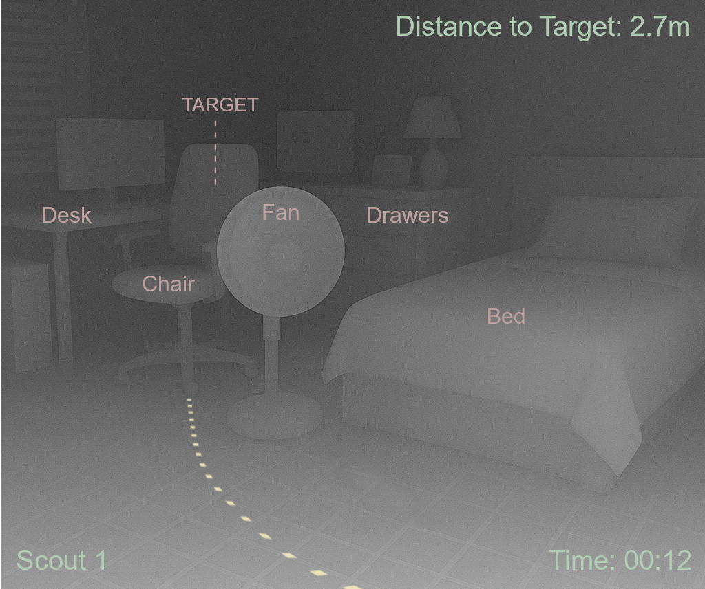
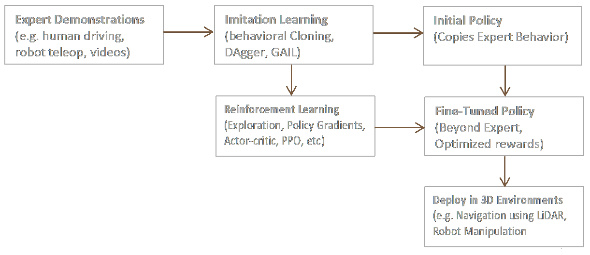

# EmbodiedAI: DarkNav
### Language-guided navigation of Embodied AI agents in the dark
**Author:** Dr. John Hughes

Language-guided object navigation **without RGB** to locate targets in unseen spaces using LiDAR/echolocation depth and a mapping stack (Isaac Sim → real robot).

> **Status:** WIP (research plan + first notebooks). Sim in Isaac Sim/Lab first; VEX V5 hardware later.

<p align="center">
  
  <br/><sub><i>"Find your way to the chair"</i></sub>
</p>

---

## Why DarkNav?
Most ObjectNav assumes cameras and light. DarkNav targets **zero-light** settings: use **active sensing** (LiDAR / ultrasonic / echo) to build geometry, fuse with language, then navigate. Depth gives actionable proximity cues, improves obstacle avoidance, and enables planning when RGB fails or isn't available.

---

## Quickstart

```bash
git clone https://github.com/DrJohnHughes/embodiedai-darknav.git
cd embodiedai-darknav
```

### Option A — CPU baseline
```bash
conda env create -f environment-cpu.yml
conda activate darknav
jupyter lab
```

### Option B — GPU (for future PyTorch/Isaac work)
```bash
conda env create -f environment-gpu.yml
conda activate darknav
jupyter lab
```

### Verify CUDA inside Python:
```python
import torch; print("torch", torch.__version__, "| cuda:", torch.cuda.is_available())
```

---

## Minimal Smoke Test (runs now)

Open [notebooks/00_smoke_test_depthviz.ipynb](notebooks/00_smoke_test_depthviz.ipynb) and run:

```python
# show depth-map image (replace with your own if desired)
from PIL import Image
from IPython.display import display
depth_map = Image.open("../assets/DarkNav.png")
scale=0.5;
display(depth_map.resize((int(depth_map.width * scale), int(depth_map.height * scale))))
```

This test confirms the environment and notebook stack work.

The Smoke Test contains other verification tests starting with a simple check that the depth maps can be converted to point clouds data. Point clouds can be used to build a volumetric 3D representation of the environment.

Additionally, the Smoke Test tests if Ollama and and LLaMA 3.2 Vision are present and, if so, makes a visual query to test extracting useful natural language guidance data from the depth map.

---

## Overview

DarkNav’s goal is to drop a robot into a previously unseen (even fully dark) room and complete language instructions like “find your way to the chair.” Instead of relying on ambient light and RGB, the agent uses active depth (LiDAR/ultrasonic/echo) to map geometry, identifies objects/affordances, and plans a safe path.

Early work runs in simulation (Isaac Sim / Isaac Lab), then transfers to a small physical platform (e.g., VEX V5). Modern phones already provide LiDAR; quick data capture is possible via mobile scanning apps before moving to on-robot sensors.

Natural-language control will be added using vision-language models (VLMs) such as Llama 3.2 Vision or Qwen-VL—to parse instructions (“find the chair”), ground them in the depth/scene representation, and produce target selections and waypoints.

### Key ideas

- Perception: depth maps / point clouds; optional semantic depth (monocular estimators) where LiDAR is unavailable.

- Mapping: SLAM to fuse multiple viewpoints; hole-filling via SDF/VDB tools or neural shape completion for occluded regions.

- Language grounding: translate “chair / desk / bed” to targets in the reconstructed scene.

- Planning: shortest path / collision-aware planner to the object’s volume; human-readable path overlays for debugging.

### Roadmap

- MVP (v0.1): Isaac Sim scene → depth/point cloud → “find X” → shortest path to target volume.

- v0.2: Echo depth (sim), simple SLAM, collision avoidance, success metrics (Success Rate, SPL, time-to-goal). IL/RL.

- v0.3: Domain randomization + robustness; export to VEX V5 (real-world pilot); natural-language control (VLM) integration.

### Pipeline sketch

- Capture → iPhone LiDAR (Polycam/LiDAR Scanner 3D) or simulated sensors

- Preprocess

   - SDF/VDB meshing & cleanup, or

   - Neural shape completion (e.g., ShapeFormer) for occlusions

- Export → USD/OBJ; Import → Isaac Sim

- Robots → e.g., Carter / TurtleBot / Spot-like (sim); VEX V5 later

- Nav → ROS2 Nav2 or learned policy in Isaac Lab

- Language → Vision-language model (VLM) for goal parsing (“find the chair”) and target selection

## Reinforcement Learning and Imitation Learning

Imitation Learning is often used to bootstrap policies which are the fine-tuned by reinforcement learning. Together they power state-of-the-art agents (e.g., AlphaStar, RT-2 robots). These processes will be investigated.

### How Imitation Learning and Reinforcement Learning can complement each other

- Start with expert demonstrations.
- Use imitation learning (behavioral cloning, DAgger, GAIL) to quickly build an initial policy.
- Then refine that policy with reinforcement learning (PPO, Actor–Critic, etc.), which goes beyond imitation by optimizing rewards.
- Finally, get a fine-tuned policy ready for deployment (e.g., robot navigation).

<p align="center">
  
  <br/><sub><i>"Imitation Learning and Reinforcement Learning informing Policy"</i></sub>
</p>


---

### Repo structure
```bash
embodiedai-darknav/
├─ notebooks/
│  ├─ 00_smoke_test_depthviz.ipynb        # runs now
│  ├─ 01_depth_sensing_basics.ipynb       # WIP
│  ├─ 02_language_goals_to_waypoints.ipynb# WIP
│  └─ 03_darknav_eval.ipynb               # WIP
├─ sim/                                   # Isaac Sim scenes/configs (WIP)
├─ src/
│  ├─ mapping/
│  ├─ planners/
│  └─ policies/
├─ assets/
│  ├─ DarkNav.png
│  ├─ DarkNav_labeled.png
│  ├─ IL-RL.png
│  ├─ IL-RL_dark.png
│  ├─ PointCloud.png
│  └─ RoomPlan.png
├─ environment-cpu.yml
├─ environment-gpu.yml
├─ requirements.txt
├─ .gitignore
├─ LICENSE
└─ README.md
```

---

#### Notes
- **Target sensors**: 2D/3D LiDAR, ultrasonic; simulated echo depth acceptable early on.
- **Metrics**: success rate, SPL, collision count, time-to-goal.
- **Ethics**: Use only spaces you’re authorized to scan; avoid collecting personally identifiable content.
---

#### License

MIT

#### Topics
`embodied-ai` `objectnav` `lidar` `slam` `multimodal` `robotics` `isaac-sim`
